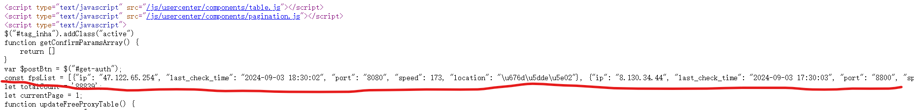

## 项目概述
### 简介
本项目实现了一个代理池，能够自动抓取、校验、存储网络上公开免费的代理IP，并提供了一个基于Flask的简单易用的获取代理IP的API。与此同时，使用schedule模块，实现了定时爬取和检测代理的任务，从而保证了代理IP的时效性和可用性。

### 什么是代理
爬虫是一种爬取目标网站数据的自动化程序，而被爬取的网站为了防止自己的数据被爬取，最常见的一种反爬手段就是ip封禁。也就是说当检测到同一个IP访问网站次数过多，频率过高就会限制这个IP的访问。
为了突破ip封禁，使用代理IP就是一个有效的手段，通过切换使用不同的代理IP，让目标站点无法检测到是同一个IP在访问，从而实现数据的顺利爬取。

### 什么是代理池
网络上的免费代理都是非常不稳定的，可用的比例很低，因此需要批量爬取这些代理IP，组成一个代理IP的“池子”，并且定期检测这些代理IP确认其可用性。如果可用就优先使用，如果不可用就降低其使用的优先级，直至将其删除。这样一来就能够在一定程度上保证能够一直从这个“池子”里，获取高可用的代理IP。

### 开发环境
- 语言：python3
- 主要依赖项：
    - requests: 发送请求，获取页面数据
    - lxml：解析页面，使用xpath从页面中提取目标数据
    - pymongo: 把提取到的代理IP数据存入MongoDB数据库，以及从数据库中读取代理IP供爬虫使用
    - flask: 提供Web API，以一种简单方便的方式获取符合条件的代理IP。
- 可以通过pip命令安装：pip install requests lxml pymongo flask


## 项目结构
项目分为五大核心模块：
### 爬虫模块： proxy_spiders
负责采集免费代理IP网站上提供的代理IP，具体工作流程如下：
1. 从网站上采集代理IP。
2. 对代理IP进行校验（使用校验模块），获取其响应速度、支持的协议类型（http或https）和匿名程度。
3. 把经过校验后确认可用的代理IP存入数据库中。

### 校验模块: proxy_validate
负责校验代理IP的响应速度、支持的协议类型（http或https）和匿名程度。
- 需要校验的原因：虽然网站上会标注代理IP的响应速度、协议类型和匿名程度，但准确性得不到保证，因此需要自己来校验。
- 校验方法：使用httpbin.org网站进行校验，这个网站会返回我们发出请求的具体详情，从而可以判断代理IP的真实情况。

### 数据库模块: db
负责存储可用的代理IP，并提供增删改查操作。
- 数据库使用MongoDB。

### 检测模块: proxy_test.py
负责定期从数据库中读取代理IP，并使用校验模块进行校验，保证代理IP的可用性。
具体工作流程如下：
1. 从数据库中读取所有代理IP
2. 逐个校验代理IP。（因为代理IP可能很多，因此可以开启多个协程异步校验，提高检测效率）
3. 如果代理IP当前不可用，就把它的分数减1，当分数为0时就把这个代理IP从数据库中删除。如果检测到代理IP当前可用，就把它的分数恢复为默认值（可在配置文件中配置）。
    - 代理IP的分数是衡量其稳定性的指标，分数越高代表其稳定性越高，可用性也就更好。

### Web服务接口模块: proxy_api.py
负责以简单便利的方式提供代理IP给爬虫使用。
有以下Web接口：
- 根据支持的协议类型（http或https）以及支持的域名获取一个随机的高质量代理IP。
- 根据支持的协议类型（http或https）以及支持的域名获取多个随机的高质量代理IP。
- 把指定的域名添加到指定代理IP的不可用域名列表中。不可用域名列表，表示这个代理IP在这些域名下是不可用的。这样一来，下次获取这个域名下可用的代理IP时，就不会返回这个代理IP了，从而进一步保证了代理IP的可用性。

除了上面的五个核心模块外，还有一些辅助模块：
### 数据模型模块：model.py
负责定义代理IP对象的数据模型，封装代理IP的相关信息，比如ip、端口、响应速度、支持的协议类型、匿名程度和分数等。

### 程序启动入口模块: main.py
负责给整个代理池项目提供的一个统一的启动入口。

### 工具模块: utils
负责提供日志功能，以及提供获取随机请求头
- 日志模块：配置日志，提供一个日志对象，记录日志信息。
- http模块：提供包含随机User-Agent的请求头，降低被网站识别为爬虫的概率。

### 配置文件: settings.py
负责项目所需的配置信息，主要包括：
- 代理IP的默认分数
- 日志的格式和等级
- 要启动的爬虫列表
- 检测爬虫的间隔时间
- 数据库的连接信息等等

### 项目文件结构
        -- IPProxyPool
            -- core
                -- db
                    -- __init__.py
                    -- mongo_pool.py
                -- proxy_validate
                    -- __init__.py
                    -- httpbin_validator.py
                -- proxy_spiders
                    -- __init__.py
                    -- base_spider.py
                    -- proxy_spiders.py
                    -- run_spiders.py
                -- proxy_test.py
                -- proxy_api.py
            -- model.py
            -- utils
                -- __init__.py
                -- http.py
                -- log.py
            -- main.py
            -- settings.py

## 项目一般工作流程
- 爬虫模块：采集代理IP -> 校验代理IP可用性 -> 可用则存入数据库。
- 检测模块: 从数据库读取代理IP -> 校验代理IP可用性 -> 根据校验结果更新或删除代理IP。
- 代理API模块：从根据提供的协议类型和域名，从数据库中获取高质量代理IP，供爬虫使用。

## 启动项目的命令
```bash
cd /your_path/IPProxyPool
python main.py
```

## Web API的使用方法
获取一个高可用随机代理IP：`locolhost:16888/random?protocol=https&domain=jd.com`
    
    - 可以指定需要支持的协议和域名，如果不指定协议则默认返回http和https都支持的代理IP，如果不指定域名则不将其作为筛选条件。

获取多个高可用代理IP：`locolhost:16888/proxies?protocol=https&domain=jd.com`
    
    - 同样可以指定或不指定protocol和domain查询参数。

## 代码实现细节
在整个项目中爬虫模块、检测模块和Web服务API模块是三个最核心的模块，对整个项目的运行起到了骨干的作用。尤其是爬虫模块，为爬取数据的过程提供了高扩展性和可配置性。因此，有必要在这里着重说明一下三个模块的的实现细节。

### 爬虫模块的实现细节
#### 作用和实现的需求
爬虫模块负责抓取代理IP网站上的免费代理IP，校验后把可用的代理IP存入数据库中。

#### 爬虫模块的设计
因为网络上很多代理IP网站网页的结构都很相似，列表页的url也很有规律，因此爬取一个代理IP网站的代码也是具有很大相似性的，可以复用。因此可以定义一个通用爬虫类，提供基本的方法和属性，而具体爬取某个网站的爬虫类可以继承通用爬虫，然后根据具体的情况稍微重写具体的方法或属性就可以了。
这样一来，爬虫的复用性和扩展性都大大提高了。

#### 通用爬虫（base_spider.py）的结构
- 定义三个类属性：url列表、分组xpath和组内xpath，分别表示要爬取网站的列表页的url列表、提取代理IP所在的分组标签的xpath和从分组标签内提取具体信息（ip、port、area）的组内xpath。
    - 这三个类属性的作用是为了让具体爬虫继承通用爬虫时重写，实现定制化。
- 提供初始化方法，这样通用爬虫也可以单独使用，而不必通过继承使用。
- 定义一个get_proxies()方法，用于从网站上爬取代理IP。
    1. 首先遍历url列表。
    2. 根据当前url发送请求，获取页面数据（使用get_page_form_url()方法）。
    3. 解析页面，提取代理IP信息，封装为Proxy对象，并返回Proxy对象生成器（使用get_proxies_from_page()方法）。
- 代码大致实现：
    ```python
    class BaseSpider:

        urls = []
        group_xpath = ''
        detail_xpath = {}

        def __init__(self, urls=[], group_xpath='', detail_xpath={}):
            if urls:
                self.urls = urls
            if group_xpath:
                self.group_xpath = group_xpath
            if detail_xpath:
                self.detail_xpath = detail_xpath

        def get_page_from_url(self, url):
            ...
        
        def get_proxies_from_page(self, page):
            ...

        def get_proxies(self):
            ...
    ```

#### 一般情况下具体爬虫的实现
一般情况下，代理IP网站都有相似的结构，因此继承通用爬虫类后只要在具体爬虫类中重写url列表、分组xpath和组内xpath，就能实现代理IP的爬取。
以ProxyListPlusSpider具体爬虫类为例，其代码大致结构如下：
```python
class ProxyListPlusSpider(BaseSpider):
    """爬取ProxyListPlus网站的爬虫类"""
    # 列表页的url列表
    urls = [f"https://list.proxylistplus.com/Fresh-HTTP-Proxy-List-{i}" for i in range(1, 7)]
    # 分组XPATH
    group_xpath = '//*[@id="page"]/table[2]/tr[position() > 2]'
    # 详情XPATH
    detail_xpath = {
        "ip": "./td[2]/text()",
        "port": "./td[3]/text()",
        "area": "./td[5]/text()",
    }
```

#### 特殊情况下的具体爬虫类实现
有时，代理IP网站的结构不能简单通过分组xpath和组内xpath的组合来获取，因此就需要重写get_proxies_from_page()方法，定制化解析页面的逻辑才能获取代理IP。
以快代理为例，其页面中的的代理IP是写在JavaScript脚本中并通过JS代码渲染到页面中的，如下：

因此需要重写解析逻辑，使用正则匹配提取代理IP信息，代码实现如下：
```python
def get_proxies_from_page(self, page):
        """从页面中提取ip、port和area并返回封装的Proxy对象"""
        # 如果页面为空, 则记录日志并结束方法执行
        if page is None:
            logger.exception(f"获取页面失败")
            return
        # 解码传入的page参数(bytes类型), 获取页面内容
        html_str = page.decode()
        # 使用正则表达式提取包含代理IP信息的字符串
        ip_list_str = re.search(r'const fpsList = (\[.*?\]);', html_str, re.S).group(1)
        # 将字符串转换为json对象(包含代理IP信息的字典组成的列表)
        ip_list_json = json.loads(ip_list_str)
        # 遍历这个列表
        for item in ip_list_json:
            # 提取ip
            ip = item['ip']
            # 提取port
            port = item['port']
            # 提取area
            area = item['location']
            # 返回Proxy对象
            yield Proxy(ip, port, area=area)
```

#### 爬虫调度的逻辑
run_spiders.py负责对各个具体爬虫的统一调度和启动。
其特点是：
- 从配置文件中读取要启动的爬虫模块的名称字符串后动态调用，从而实现了启动调度爬虫的高度可配置性和灵活性。
- 爬虫是网络IO密集型程序，因此使用了协程池的方式并发调度多个爬虫，大大提高爬取效率。
代码大致实现如下：
```python
def get_spider_from_settings(self):
    """根据配置文件信息, 返回爬虫对象列表"""
    for path in PROXIES_SPIDERS:
        # 根据配置字符串解析出爬虫模块名和爬虫类名
        module_name, cls_name = path.rsplit('.', maxsplit=1)
        # 动态加载爬虫模块
        module = importlib.import_module(module_name)
        # 从爬虫模块中获取爬虫对象
        spider_cls = getattr(module, cls_name)
        # 创建爬虫实例，并通过生成器方式返回
        spider = spider_cls()
        yield spider

def __execute_one_spider_task(self, spider):
    """把处理一个爬虫的代码抽到这个方法中"""
    # 处理异常, 防止一个爬虫内部出错了, 影响其他的爬虫. 
    try:
        # 遍历爬虫对象的get_proxies方法, 获取代理IP对应的Proxy对象
        for proxy in spider.get_proxies():
            # 检测代理IP(代理IP检测模块)
            print(f'正在检测: {proxy}')
            proxy = check_proxy(proxy)
            # 如果代理IP可用（speed不为-1）,就存入数据库
            if proxy.speed != -1:
                self.mongo_pool.insert_one(proxy)
    # 捕获异常,打印异常信息
    except Exception as e:
        logger.exception(e)


def run(self):
    """提供一个运行爬虫的run方法, 作为运行爬虫的入口, 实现核心的处理逻辑
    """
    # 获取爬虫对象生成器
    spiders = self.get_spider_from_settings()
    # 遍历爬虫对象
    for spider in spiders:
        # 用异步协程的方式执行每个爬虫的任务
        self.gevent_pool.apply_async(self.__execute_one_spider_task, args=(spider, ))
    # 阻塞主线程使其等待所有协程任务执行完毕
    self.gevent_pool.join()
```
除此之外，还使用schedule模块实现了定期启动爬虫从而保证爬取代理IP的时效性。而爬虫的启动的周期也都可以在配置文件中进行配置。

### 检测模块的实现细节
检测模块负责定期检测数据库中的代理IP的有效性，进而更新或者删除代理IP，保证数据库中的代理IP的高可用性。
其实实现特点如下：
- 因为数据库中的代理IP可能很多，所以也要以协程并发的方式提高检测效率，但同时又因为太多所以不可能给每个代理IP的检测任务都设置一个协程。因此这里的逻辑是，先创建一个容纳合理数量协程的协程池，然后其中的检测任务以回调函数递归回调的方式不断更新自己，当一个检测任务结束时，协程池中当前的位置立马被新的检测任务替代。这样一来既使用并发保证了效率，又不至于让资源过载。
- 使用队列的方式传递Proxy对象，实现协程间通信。

代码大致实现如下：
```python
def run(self):
        """执行检测代理IP的过程的核心逻辑"""
        # 从数据库获取所有代理IP的proxy对象
        proxies = self.mongo_pool.find_all()
        # 遍历proxy对象
        for proxy in proxies:
            # 把要检测的proxy放入队列
            self.queue.put(proxy)
        # 根据配置的并发数量，创建协程池中的并发协程
        for _ in range(TEST_PROXY_ASYNC_COUNT):
            # 把检测一个proxy的方法加入协程池，并指定回调函数
            self.gevent_pool.apply_async(
                self.__check_one_proxy, callback=self.__check_callback
            )
        # 阻塞线程，使其等待队列中的任务全部完成
        self.queue.join()

def __check_callback(self, temp):
    """回调函数
    不断回调自己从而实现循环（不断把检测proxy的方法加入协程池）
    """
    self.gevent_pool.apply_async(
        self.__check_one_proxy, callback=self.__check_callback
    )
```
代码中的`self.__check_one_proxy()`是具体检测一个代理IP的方法，细节不在此赘述了。
除此之外，检测模块也使用了schedule模块实现了定期启动。


### Web API模块的实现细节
Web API模块使用Flask搭建了一个本地的简易服务器，通过访问服务器在本地的端口，并携带`protocol`和`domain`参数指定代理IP支持的协议和域名，可以从数据库中获取一个随机代理IP、获取多个代理IP，以及添加一个域名到指定代理IP的不可用域名列表中。
具体的代码实现，就不在此赘述了。
